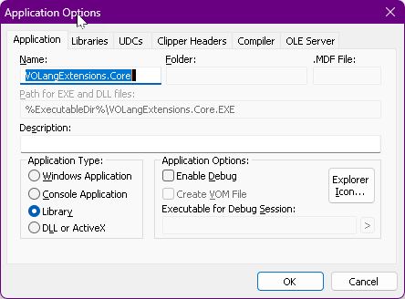
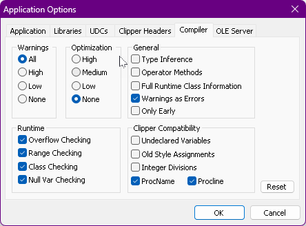
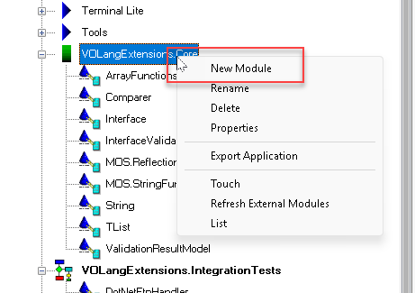
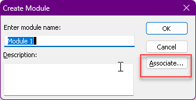
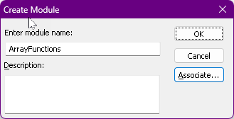

> Work in progress.
> This project is still a work in progress & might get some major changes as it evolves.
> If anything is unclear or you have some feedback, 
> feel free to create an issue for it in order to discuss it.

# Introduction
This project is mainly focussed around the idea of introducing interfaces into the Visual Objects environment.
While other efforts like XSharp exist in order to transform Visual Objects codebases into something more modern,
its sometimes impossible to directly migrate a project into that language. That is because sometimes the codebase uses rarely know functions.
Sometimes there is even a hack around the language features that gets rejected by the XSharp migration tool.

# Using the sample project
This project is setup in such a way that you can immediately open `VOLangExtensions.VoPrj` for a glimpse
of how the interfaces are introduced. The only requirement is to clone the git repo into:
`D:\Develop\Repos\VOLangExtensions`. If for any reason its not possible to clone into the D drive, you
can use the [subst](https://learn.microsoft.com/en-us/windows-server/administration/windows-commands/subst)
command from Windows or any other methods like a 
[VHD](https://learn.microsoft.com/en-us/windows-server/storage/disk-management/manage-virtual-hard-disks) 
to create a Fake D drive.

In order to actually run the included `VOLangExtensions.IntegrationTests` app you also need to ensure
a `Bin` folder including a `Debug` folder also exists. Oterhwise you will get an error similar to:
`Invalid path: D:\Develop\Repos\VOLangExtensions\Bin\Debug\`.
That is because the `Bin` folder is ignored by git as it contains generated files rather than the
actual app/library logic. Visual Objects is not smart however to automatically make that path &
stops trying to do anyhting if that path doesn't exist!

# Implementation of the idea

## Step 1 - Include `CodeFile/VOLangExtensions.Core.SCC` folder contents
Create a library out of the contents of `VOLangExtensions.Core.SCC` & make sure the library contains 
the following references:
- "System Classes"
- "GUI Classes"
- "RDD Classes"
- "Tools"
- "Terminal Lite"
- "Console Classes"


Make sure the library is maked as a library:



Next make sure  that the following compiler options are set:



To make importing easier, there are some tools withing this project, but those need a little bit
extra explanation. For now what you can do is using the associate button when creating new modules:





After choosing the external module, for example `ArrayFunctions.prg` the new module popup will look
something like this & you can press ok and import another module:



Importing modules this way will allow external modification, but you can also make those modules internal
by cuttin the link to those external files.

## Step 2 - Introduce a central interface validation function

Regardless of how the test code is set up or how you introduce it, there should be a point where you 
want to validate the interfaces. This project contains a `VOLangExtensions.IntegrationTests.SCC` folder
with the following `Start` module which shows how the interface validation is triggered:

	METHOD Start() CLASS App
	
		LOCAL console := TermConsole{} AS TermConsole
		LOCAL validationOutput := ValidationResultModel{} AS ValidationResultModel
	
		console:WriteLine("Validating interfaces ...")
		DO CASE
		CASE !TestIfAllClassesHaveValidInterfaceImplementations(validationOutput)
			console:WriteLine("One or more errors occured while validating interfaces:")
			console:WriteLine(JoinStringList(CRLF, validationOutput:Errors))
			console:Wait()
		ENDCASE
	
		console:WriteLine("Done validating interfaces")
		console:Wait()
	
	RETURN TRUE

The main entry point right now is: ` TestIfAllClassesHaveValidInterfaceImplementations`. This might get
refactored in later revisions, but for now its the function required for the tests to run.

## Step 2 - Introduce some interface abstractions you want to use

Note however that due to the limitations of Visual Objects, only interface methods can be verified in
the most reliable way. That does not mean 100% interface method validations however as even that comes
with its own limitations. For full analysis a static analyzer needs to be written next to this library.
Static analysis is not the main foucs of this project however, so if its going to be included it
won't be in early versions of this library!

Limitations in VO's reflection functions include distinction between instance, access, assign members, 
etc. Those are just lumped together & accessible through an `IVarListClass` function.
Other limitations are related to method signature. Its not possible to get type info regarding a method
singature and even the parameter info is limited to number of params.

If you intend to introduce an interface you need to work in a disciplined way and manually verify
method signatures of adjusted classes. The framework will only tell you if there are corresponding
method names for a certain interface. It will not tell you if those methods have the correct signature.

For sample code of how to use interfaces you can see the `VOLangExtensions.IntegrationTests.SCC` folder
again. This folder contians 2 Ftp related interfaces & a DotNetFtpHandler class implementing these 
interfaces halfway:

```
CLASS IAbstractFtpHandler INHERIT Interface
/* This class is meant as an interface, do not add implementations here! */
/* In order to guarantee the implementing class is valid, you will need to: */
/* 1. Add a conversion method like AsFtpHandler() that creates this interface through an Adapter class */
/* 2. Call HasValidInterfaceImplementations in a unit test */
/* Note however that this is limited to method names since reflection is very basic in VO!*/
DECLARE METHOD ListDirectory
DECLARE METHOD DeleteFile
DECLARE METHOD CloseRemote
DECLARE METHOD IsConnected
DECLARE METHOD SetCurdir
DECLARE METHOD LoadDirectoryListing
DECLARE METHOD GetLowLevel
DECLARE METHOD GetAccessType
DECLARE METHOD SetAccessType
METHOD CloseRemote() AS USUAL STRICT CLASS IAbstractFtpHandler
RETURN Send(SELF:_implement, GetCurrentMethodName())
METHOD DeleteFile(fileToDelete AS STRING) AS LOGIC STRICT CLASS IAbstractFtpHandler
RETURN Send(SELF:_implement, GetCurrentMethodName(), fileToDelete)
METHOD GetAccessType() AS DWORD STRICT CLASS IAbstractFtpHandler
RETURN Send(SELF:_implement, GetCurrentMethodName())
METHOD GetLowLevel(remoteFileName AS STRING, localFilePath AS STRING) AS USUAL STRICT CLASS IAbstractFtpHandler
RETURN Send(SELF:_implement, GetCurrentMethodName())
METHOD IsConnected() AS LOGIC STRICT CLASS IAbstractFtpHandler
RETURN Send(SELF:_implement, GetCurrentMethodName())
METHOD ListDirectory(filePattern AS STRING) AS USUAL STRICT CLASS IAbstractFtpHandler
RETURN Send(SELF:_implement, GetCurrentMethodName(), filePattern)
METHOD LoadDirectoryListing(filePattern AS STRING) AS USUAL STRICT CLASS IAbstractFtpHandler
RETURN Send(SELF:_implement, GetCurrentMethodName(), filePattern)
METHOD SetAccessType(newValue AS DWORD) AS DWORD STRICT CLASS IAbstractFtpHandler
RETURN Send(SELF:_implement, GetCurrentMethodName(), newValue)
METHOD SetCurdir(baseRemotePath AS STRING) AS LOGIC STRICT CLASS IAbstractFtpHandler
RETURN Send(SELF:_implement, GetCurrentMethodName(), baseRemotePath)
``` 

```
CLASS IAbstractFtpHandlerByFtpId INHERIT IAbstractFtpHandler
DECLARE METHOD ConnectRemoteByFtpId
DECLARE METHOD SetInfoHandler
METHOD ConnectRemoteByFtpId(ftpId AS STRING) AS ValidationResultModel STRICT CLASS IAbstractFtpHandlerByFtpId
RETURN Send(SELF:_implement, GetCurrentMethodName(), ftpId)
METHOD SetInfoHandler(infoHandler AS IAbstractInfoHandler) AS USUAL STRICT CLASS IAbstractFtpHandlerByFtpId
RETURN Send(SELF:_implement, GetCurrentMethodName(), infoHandler)
```

```
CLASS DotNetFtpHandler
// This class is intentionally incomplete in order to make it surface through the interface validation functions!
DECLARE METHOD IsConnected
DECLARE METHOD ConnectRemoteByFtpId
DECLARE METHOD CloseRemote
DECLARE METHOD SetCurDir
HIDDEN _connectedFtpId AS STRING
HIDDEN _baseRemotePath AS STRING
DECLARE METHOD GetDirectory
DECLARE METHOD AsAbstractFtpHandlerByFtpId
METHOD AsAbstractFtpHandlerByFtpId() AS IAbstractFtpHandlerByFtpId STRICT CLASS DotNetFtpHandler
RETURN IAbstractFtpHandlerByFtpId{SELF}
METHOD CloseRemote() AS LOGIC STRICT CLASS DotNetFtpHandler
	_connectedFtpId := ""
RETURN TRUE
METHOD ConnectRemoteByFtpId(bakeItId AS STRING) AS ValidationResultModel STRICT CLASS DotNetFtpHandler
	LOCAL validationResult := ValidationResultModel{} AS ValidationResultModel
	_connectedFtpId := ""
	IF TRUE // VOCSService:TestFtpConnectionById(bakeItId)
		_connectedFtpId := bakeItId
	ENDIF
	IF !SELF:IsConnected()
		validationResult:AddValidationError("Could not establish ftp connection. See logs for info!")
	ENDIF
RETURN validationResult
METHOD GetDirectory(pattern AS STRING) AS LOGIC STRICT CLASS DotNetFtpHandler
RETURN FALSE
METHOD IsConnected AS LOGIC STRICT CLASS DotNetFtpHandler
RETURN !Empty(_connectedFtpId)
METHOD SetCurDir(baseRemotePath AS STRING) AS LOGIC STRICT CLASS DotNetFtpHandler
	_baseRemotePath := baseRemotePath
RETURN TRUE
```

To use this you need a minor change in how you call the implementations. So instead of directly passing 
a concrete implementation, you pass the abstraction instead through the introduced cast method:

```
LOCAL ftpHandler := DotNetFtpHanlder{} AS DotNetFtpHanlder
LOCAL someOtherInstance := SomeOtherClass{} AS SomeOtherClass

someOtherInstance:RunFtpLogic(ftpHandler:AsAbstractFtpHandlerByFtpId())
```

That also means that you need to change the method signature of the called class to use the abstractions 
instead of the direct class.

If necessary, this can even be expanded further to use some kind of dictionary or factory class to 
generate an abstraction by some kind of config:

```
METHOD CreateFtpHanlder() AS IAbstractDataServer STRICT CLASS ExampleClass
	DO CASE
	CASE SELF:DBConfig == "OldFTP"
		// Note: Intellisense might stop after the method call, 
		// but the compiler still checks the second chain. after that checks will stops.
		RETURN SELF:CreateVOFtpHandler():AsAbstractFtpHandlerByFtpId()
	CASE SELF:DBConfig == "ModernFTP"
		RETURN SELF:CreateDotNetFtpHandler():AsAbstractFtpHandlerByFtpId()
	ENDCASE
RETURN SELF:CreateDotNetFtpHandler():AsAbstractFtpHandlerByFtpId()
```

This approach allows the introduction of interface-like behavior in VO to gradually replace 
implementations with configurations that can adjusted at runtime.